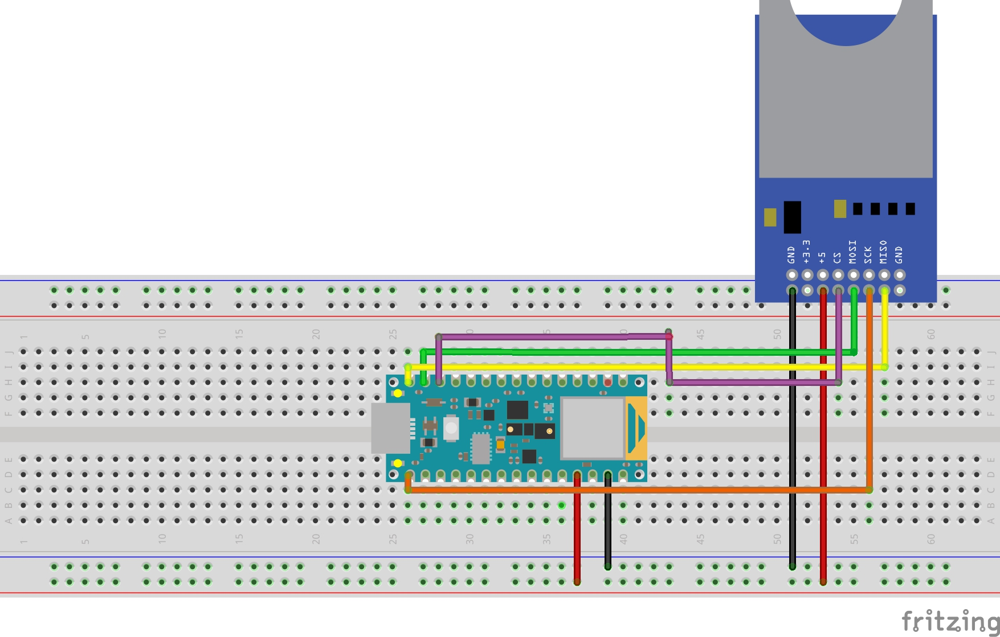

# Arduino Installation

# Introduction
This guide will guide you through the installation process for the **ALL Arduino Nano 33 BLE Sense Classifier** Arduino project.

&nbsp;

# Operating System
This project requires the Windows 10 operating system(s), but may work as described on other OS.

&nbsp;

# Hardware
The following hardware is required for this project:

- [Arduino Nano 33 BLE Sense](https://store.arduino.cc/arduino-nano-33-ble-sense)
- [kwmobile Micro SD Card Module for Arduino](https://www.amazon.es/gp/product/B06XHJTGGC)
- [SD Card](https://www.amazon.es/Tarjeta-Memoria-Kingston-32GB-Micro/dp/B00JRZIOIE)

&nbsp;

# Software
The following Arduino software libraries are used with this project:

- [Arduino Tensorflow Lite](https://github.com/tensorflow/tflite-micro)
- [JpegDecoder](https://github.com/Bodmer/JPEGDecoder)

&nbsp;

# Prerequisites
You will need to ensure you have installed the following software and followed the provided guides:

- [Ubuntu Installation Guide](../installation/ubuntu.md)
- [Python Usage Guide](../usage/python.md) or [Jupyter Notebooks Usage Guide](../usage/notebooks.md)
- [Arduino IDE](https://www.arduino.cc/en/software)
- [Getting started with the Arduino Nano 33 BLE Sense](https://www.arduino.cc/en/Guide/NANO33BLESense)
- [Why doesn't the 5V pin work in the Arduino Nano 33 BLE boards?](https://support.arduino.cc/hc/en-us/articles/360014779679-Why-doesn-t-the-5V-pin-work-in-the-Arduino-Nano-33-BLE-boards-)

&nbsp;

# Setup

Follow the diagram above to connect your SD card reader to the Arduino Nano 33 BLE Sense.

&nbsp;

# Continue

Now you are ready to use your Arduino Nano 33 BLE Sense. Head over to the [Arduino Usage Guide](../usage/arduino.md) for instructions on how to use your model with the Arduino.

&nbsp;

# Contributing
Asociación de Investigacion en Inteligencia Artificial Para la Leucemia Peter Moss encourages and welcomes code contributions, bug fixes and enhancements from the Github community.

Please read the [CONTRIBUTING](https://github.com/AMLResearchProject/ALL-Arduino-Nano-33-BLE-Sense-Classifier/blob/main/CONTRIBUTING.md "CONTRIBUTING") document for a full guide to forking our repositories and submitting your pull requests. You will also find our code of conduct in the [Code of Conduct](https://github.com/AMLResearchProject/ALL-Arduino-Nano-33-BLE-Sense-Classifier/blob/main/CODE-OF-CONDUCT.md) document.

## Contributors
- [Adam Milton-Barker](https://www.leukemiaairesearch.com/association/volunteers/adam-milton-barker "Adam Milton-Barker") - [Asociación de Investigacion en Inteligencia Artificial Para la Leucemia Peter Moss](https://www.leukemiaresearchassociation.ai "Asociación de Investigacion en Inteligencia Artificial Para la Leucemia Peter Moss") President/Founder & Lead Developer, Sabadell, Spain

&nbsp;

# Versioning
We use [SemVer](https://semver.org/) for versioning.

&nbsp;

# License
This project is licensed under the **MIT License** - see the [LICENSE](https://github.com/AMLResearchProject/ALL-Arduino-Nano-33-BLE-Sense-Classifier/blob/main/LICENSE "LICENSE") file for details.

&nbsp;

# Bugs/Issues
We use the [repo issues](https://github.com/AMLResearchProject/ALL-Arduino-Nano-33-BLE-Sense-Classifier/issues "repo issues") to track bugs and general requests related to using this project. See [CONTRIBUTING](https://github.com/AMLResearchProject/ALL-Arduino-Nano-33-BLE-Sense-Classifier/blob/main/CONTRIBUTING.md "CONTRIBUTING") for more info on how to submit bugs, feature requests and proposals.