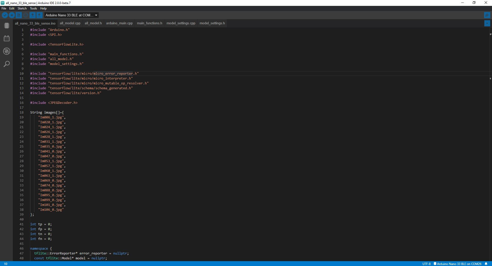

# Arduino Usage


# Introduction
This guide will take you through the using the **ALL Arduino Nano 33 BLE Sense Classifier** to detect Acute Lymphoblastic Leukemia.

&nbsp;

# Installation
First you need to install the required software for training the model and setup your Arduino Nano 33 BLE Sense. Below are the available installation guides:

- [Ubuntu installation guide](../installation/ubuntu.md).
- [Arduino installation guide](../installation/arduino.md).

&nbsp;

# Training
Before you can start to use this tutorial you must have already trained your classifier, to do so use one of the following guides:

- [Python Usage Guide](../usage/python.md).
- [Jupyter Notebooks Usage Guide](../usage/notebooks.md)

&nbsp;

# Arduino IDE



Open your Arduino IDE and open the **all_nano_33_ble_sense** sketch located in the Arduino folder in the project root.

&nbsp;

# C Array Model
Now you need to import your C array model into the Arduino project. On your development machine navigate to the **model** dir located in the project root and open the **all_nano_33_ble_sense.cc** file. First you need to copy the model and replace everything within **all_model[]{}** with your newly created model. Next you need to replace **all_model_len** with the actual length of your model which is found at the bottom of your model file.

&nbsp;

# Run The Classifier
Now it is time to run your classifier on the Arduino Nano 33 BLE Sense. Make sure you are connected to your Arduino and click on the **upload** button. Once the model is uploaded it will start to run, open your serial monitor and watch the output.

``` bash
19:22:40.139 -> Initialising SD card...
19:22:40.148 -> Initialisation done.
19:22:40.158 ->
19:22:40.163 -> Model input info
19:22:40.274 -> ===============
19:22:40.284 -> Dimensions: 4
19:22:40.299 -> Dim 1 size: 1
19:22:40.314 -> Dim 2 size: 100
19:22:40.328 -> Dim 3 size: 100
19:22:40.343 -> Dim 4 size: 3
19:22:40.354 -> Input type: 9
19:22:40.365 -> ===============
19:22:40.375 ->
19:22:40.381 -> Im006_1.jpg
19:22:40.458 -> ===============
19:22:40.468 -> ALL positive score: -7
19:22:40.483 -> ALL negative score: -18
19:22:40.504 -> True Positive
19:22:40.515 ->
19:22:40.521 -> Im020_1.jpg
19:22:43.194 -> ===============
19:22:43.201 -> ALL positive score: -14
19:22:43.223 -> ALL negative score: -6
19:22:43.229 -> False Negative
19:22:43.238 ->
19:22:43.241 -> Im024_1.jpg
19:22:45.916 -> ===============
19:22:45.922 -> ALL positive score: 18
19:22:45.928 -> ALL negative score: 24
19:22:45.938 -> False Negative
19:22:45.946 ->
19:22:45.950 -> Im026_1.jpg
19:22:48.680 -> ===============
19:22:48.685 -> ALL positive score: 27
19:22:48.695 -> ALL negative score: 24
19:22:48.705 -> True Positive
19:22:48.714 ->
19:22:48.719 -> Im028_1.jpg
19:22:51.409 -> ===============
19:22:51.416 -> ALL positive score: 13
19:22:51.427 -> ALL negative score: 18
19:22:51.439 -> False Negative
19:22:51.448 ->
19:22:51.454 -> Im031_1.jpg
19:22:54.138 -> ===============
19:22:54.148 -> ALL positive score: -13
19:22:54.164 -> ALL negative score: -16
19:22:54.179 -> True Positive
19:22:54.183 ->
19:22:54.188 -> Im035_0.jpg
19:22:56.883 -> ===============
19:22:56.890 -> ALL positive score: 12
19:22:56.901 -> ALL negative score: 20
19:22:56.908 -> True Negative
19:22:56.916 ->
19:22:56.921 -> Im041_0.jpg
19:22:59.631 -> ===============
19:22:59.640 -> ALL positive score: 14
19:22:59.653 -> ALL negative score: 6
19:22:59.663 -> False Positive
19:22:59.673 ->
19:22:59.679 -> Im047_0.jpg
19:23:02.365 -> ===============
19:23:02.373 -> ALL positive score: 25
19:23:02.384 -> ALL negative score: 20
19:23:02.393 -> False Positive
19:23:02.399 ->
19:23:02.404 -> Im053_1.jpg
19:23:05.160 -> ===============
19:23:05.174 -> ALL positive score: 39
19:23:05.190 -> ALL negative score: 5
19:23:05.202 -> True Positive
19:23:05.218 ->
19:23:05.223 -> Im057_1.jpg
19:23:07.881 -> ===============
19:23:07.896 -> ALL positive score: 6
19:23:07.912 -> ALL negative score: -1
19:23:07.928 -> True Positive
19:23:07.937 ->
19:23:07.942 -> Im060_1.jpg
19:23:10.618 -> ===============
19:23:10.630 -> ALL positive score: 25
19:23:10.648 -> ALL negative score: 12
19:23:10.661 -> True Positive
19:23:10.667 ->
19:23:10.673 -> Im063_1.jpg
19:23:13.359 -> ===============
19:23:13.368 -> ALL positive score: 23
19:23:13.382 -> ALL negative score: -52
19:23:13.400 -> True Positive
19:23:13.411 ->
19:23:13.417 -> Im069_0.jpg
19:23:16.097 -> ===============
19:23:16.108 -> ALL positive score: -4
19:23:16.129 -> ALL negative score: 34
19:23:16.148 -> True Negative
19:23:16.159 ->
19:23:16.164 -> Im074_0.jpg
19:23:18.812 -> ===============
19:23:18.819 -> ALL positive score: 22
19:23:18.834 -> ALL negative score: 18
19:23:18.850 -> False Positive
19:23:18.861 ->
19:23:18.867 -> Im088_0.jpg
19:23:21.564 -> ===============
19:23:21.575 -> ALL positive score: -21
19:23:21.594 -> ALL negative score: -24
19:23:21.613 -> False Positive
19:23:21.625 ->
19:23:21.630 -> Im095_0.jpg
19:23:24.274 -> ===============
19:23:24.284 -> ALL positive score: -33
19:23:24.302 -> ALL negative score: -38
19:23:24.321 -> False Positive
19:23:24.333 ->
19:23:24.339 -> Im099_0.jpg
19:23:27.014 -> ===============
19:23:27.025 -> ALL positive score: -46
19:23:27.042 -> ALL negative score: -22
19:23:27.062 -> True Negative
19:23:27.074 ->
19:23:27.080 -> Im101_0.jpg
19:23:29.769 -> ===============
19:23:29.779 -> ALL positive score: -17
19:23:29.796 -> ALL negative score: -14
19:23:29.816 -> True Negative
19:23:29.830 ->
19:23:29.837 -> Im106_0.jpg
19:23:32.530 -> ===============
19:23:32.545 -> ALL positive score: -42
19:23:32.562 -> ALL negative score: -45
19:23:32.587 -> False Positive
19:23:32.602 ->
19:23:32.609 -> True Positives: 7
19:23:34.833 -> False Positives: 6
19:23:34.844 -> True Negatives: 4
19:23:34.858 -> False Negatives: 3
```

&nbsp;

# Conclusion

We see that our model that can correctly classify all twenty images only gets 11/20 when running on Arduino. There are some additional testing steps we can take which will be introduced in V2 that will allow us to test the Arduino model on our development machine to help identify where the bug is coming from. For now this is a good first attempt at building a classifier to  detect Acute Lymphoblastic Leukemia detection on Arduino. If you would like to view the ongoing issue in the Tensorflow Micro repository [click here](https://github.com/tensorflow/tflite-micro/issues/287), thanks to [Advait Jain](https://github.com/advaitjain) for the asistance with this issue.

&nbsp;

# Continue

Now you are ready to set up your Arduino Nano 33 BLE Sense. Head over to the [Arduino Installation Guide](../installation/arduino.md) to prepare your Arduino.

&nbsp;

# Contributing
Asociación de Investigacion en Inteligencia Artificial Para la Leucemia Peter Moss encourages and welcomes code contributions, bug fixes and enhancements from the Github community.

Please read the [CONTRIBUTING](https://github.com/AMLResearchProject/ALL-Arduino-Nano-33-BLE-Sense-Classifier/blob/main/CONTRIBUTING.md "CONTRIBUTING") document for a full guide to forking our repositories and submitting your pull requests. You will also find our code of conduct in the [Code of Conduct](https://github.com/AMLResearchProject/ALL-Arduino-Nano-33-BLE-Sense-Classifier/blob/main/CODE-OF-CONDUCT.md) document.

## Contributors
- [Adam Milton-Barker](https://www.leukemiaairesearch.com/association/volunteers/adam-milton-barker "Adam Milton-Barker") - [Asociación de Investigacion en Inteligencia Artificial Para la Leucemia Peter Moss](https://www.leukemiaresearchassociation.ai "Asociación de Investigacion en Inteligencia Artificial Para la Leucemia Peter Moss") President/Founder & Lead Developer, Sabadell, Spain

&nbsp;

# Versioning
We use [SemVer](https://semver.org/) for versioning.

&nbsp;

# License
This project is licensed under the **MIT License** - see the [LICENSE](https://github.com/AMLResearchProject/ALL-Arduino-Nano-33-BLE-Sense-Classifier/blob/main/LICENSE "LICENSE") file for details.

&nbsp;

# Bugs/Issues
We use the [repo issues](https://github.com/AMLResearchProject/ALL-Arduino-Nano-33-BLE-Sense-Classifier/issues "repo issues") to track bugs and general requests related to using this project. See [CONTRIBUTING](https://github.com/AMLResearchProject/ALL-Arduino-Nano-33-BLE-Sense-Classifier/blob/main/CONTRIBUTING.md "CONTRIBUTING") for more info on how to submit bugs, feature requests and proposals.