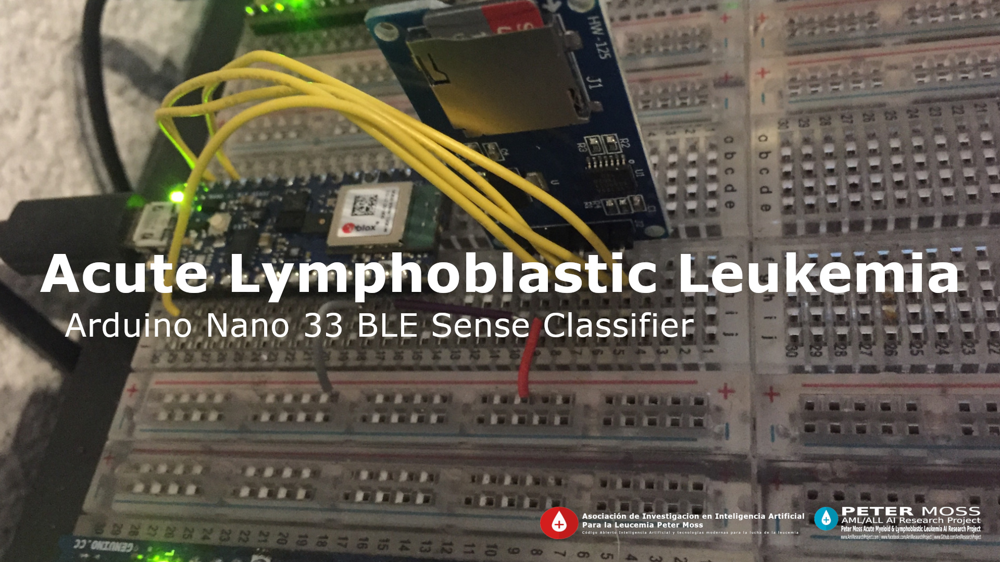
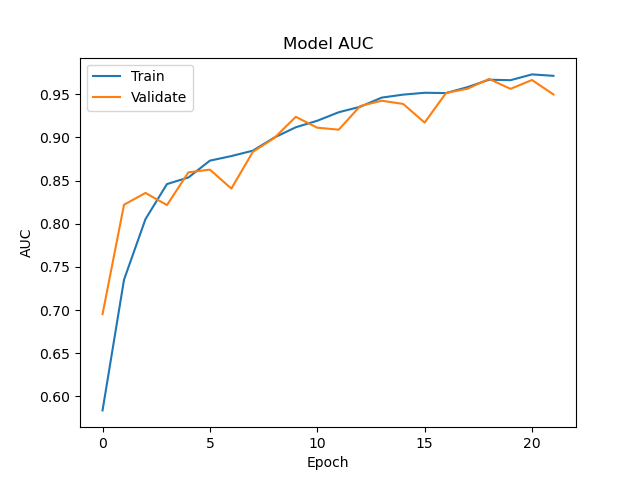

# Python Usage



# Introduction
This guide will take you through the using the **ALL Arduino Nano 33 BLE Sense Classifier** Python trainer to train and test your classifier.

&nbsp;

# Installation
First you need to install the required software for training the model. Below are the available installation guides:

- [Ubuntu installation guide](../installation/ubuntu.md).

&nbsp;

# Network Architecture
We will build a Convolutional Neural Network with the following architecture:

- Average pooling layer
- Conv layer
- Depthwise conv layer
- Flatten layer
- Fully connected layer
- Softmax layer

&nbsp;

# Data
You need to be granted access to use the Acute Lymphoblastic Leukemia Image Database for Image Processing dataset. You can find the application form and information about getting access to the dataset on [this page](https://homes.di.unimi.it/scotti/all/#download) as well as information on how to contribute back to the project [here](https://homes.di.unimi.it/scotti/all/results.php).

_If you are not able to obtain a copy of the dataset please feel free to try this tutorial on your own dataset._

Once you have your data you need to add it to the project filesystem. You will notice the data folder in the Model directory, **model/data**, inside you have **train** & **test**. Add all of the images from the ALL_IDB1 dataset to the **model/data/train** folder.

## Data Augmentation

We will create an augmented dataset based on the [Leukemia Blood Cell Image Classification Using Convolutional Neural Network](http://www.ijcte.org/vol10/1198-H0012.pdf "Leukemia Blood Cell Image Classification Using Convolutional Neural Network") by T. T. P. Thanh, Caleb Vununu, Sukhrob Atoev, Suk-Hwan Lee, and Ki-Ryong Kwon.

## Application testing data

In the data processing stage, ten negative images and ten positive images are removed from the dataset and moved to the **model/data/test/** directory. This data is not seen by the network during the training process, and is used to test the performance of the model.

To ensure your model gets the same results, you should use the same test images. You can also try with your own image selection, however results may vary.

To specify which test images to use modify the [configuration/config.json](../configuration/config.json) file as shown below:

``` json
"test_data": [
    "Im006_1.jpg",
    "Im020_1.jpg",
    "Im024_1.jpg",
    "Im026_1.jpg",
    "Im028_1.jpg",
    "Im031_1.jpg",
    "Im035_0.jpg",
    "Im041_0.jpg",
    "Im047_0.jpg",
    "Im053_1.jpg",
    "Im057_1.jpg",
    "Im060_1.jpg",
    "Im063_1.jpg",
    "Im069_0.jpg",
    "Im074_0.jpg",
    "Im088_0.jpg",
    "Im095_0.jpg",
    "Im099_0.jpg",
    "Im101_0.jpg",
    "Im106_0.jpg"
],
```

&nbsp;

# Configuration

All configuration can be found in the **configuration/config.json** file.

``` json
{
    "agent": {
        "cores": 8,
        "ip": "",
        "port": 1234,
        "params": [
            "train",
            "classify",
            "server",
            "classify_http"
        ]
    },
    "data": {
        "dim": 100,
        "file_type": ".jpg",
        "labels": [0, 1],
        "rotations": 10,
        "seed": 2,
        "split": 0.255,
        "test": "model/data/test",
        "test_data": [
            "Im006_1.jpg",
            "Im020_1.jpg",
            "Im024_1.jpg",
            "Im026_1.jpg",
            "Im028_1.jpg",
            "Im031_1.jpg",
            "Im035_0.jpg",
            "Im041_0.jpg",
            "Im047_0.jpg",
            "Im053_1.jpg",
            "Im057_1.jpg",
            "Im060_1.jpg",
            "Im063_1.jpg",
            "Im069_0.jpg",
            "Im074_0.jpg",
            "Im088_0.jpg",
            "Im095_0.jpg",
            "Im099_0.jpg",
            "Im101_0.jpg",
            "Im106_0.jpg"
        ],
        "train_dir": "model/data/train",
        "valid_types": [
            ".jpg"
        ]
    },
    "model": {
        "model": "model/all_nano_33_ble_sense.json",
        "model_c_array": "model/all_nano_33_ble_sense.cc",
        "tfmodel": "model/all_nano_33_ble_sense.tflite",
        "weights": "model/all_nano_33_ble_sense.h5"
    },
    "train": {
        "batch": 100,
        "decay_adam": 1e-6,
        "epochs": 150,
        "learning_rate_adam": 1e-4,
        "val_steps": 10
    }
}
```

You should update the following values:

- **agent->cores** Should represent the amount of cores your CPU has.
- **agent->ip** Should be the IP of the machine you will run your test server on.
- **agent->port** Should be the port you will run your test server on.

You can modify the values in the train object as required, however to ensure you achieve the same results you can leave them as they are.

# Training
Now you are ready to train your model.

## Metrics
We can use metrics to measure the effectiveness of our model. In this network you will use the following metrics:

```
tf.keras.metrics.BinaryAccuracy(name='accuracy'),
tf.keras.metrics.Precision(name='precision'),
tf.keras.metrics.Recall(name='recall'),
tf.keras.metrics.AUC(name='auc')
```

These metrics will be displayed and plotted once our model is trained.  A useful tutorial while working on the metrics was the [Classification on imbalanced data](https://www.tensorflow.org/tutorials/structured_data/imbalanced_data) tutorial on Tensorflow's website.

## Start Training
Ensuring you have completed all previous steps, you can start training using the following command.

``` bash
python classifier.py train
```

This tells the application to start training the model.

## Training Data
First the training and validation data will be prepared.

``` bash
2021-07-18 17:42:26,075 - Classifier - INFO - Augmented data size: 1584
2021-07-18 17:42:26,075 - Classifier - INFO - Negative data size: 882
2021-07-18 17:42:26,076 - Classifier - INFO - Positive data size: 702
2021-07-18 17:42:26,076 - Classifier - INFO - Augmented data shape: (1584, 100, 100, 3)
2021-07-18 17:42:26,076 - Classifier - INFO - Labels shape: (1584, 2)
2021-07-18 17:42:26,267 - Classifier - INFO - Training data: (1180, 100, 100, 3)
2021-07-18 17:42:26,267 - Classifier - INFO - Training labels: (1180, 2)
2021-07-18 17:42:26,267 - Classifier - INFO - Validation data: (404, 100, 100, 3)
2021-07-18 17:42:26,267 - Classifier - INFO - Validation labels: (404, 2)
2021-07-18 17:42:26,267 - Classifier - INFO - Data preperation complete.
```

### Model Summary

Before the model begins training, you will be shown the model summary.

``` bash
Model: "AllANBS"
_________________________________________________________________
Layer (type)                 Output Shape              Param #
=================================================================
average_pooling2d (AveragePo (None, 50, 50, 3)         0
_________________________________________________________________
conv2d (Conv2D)              (None, 46, 46, 30)        2280
_________________________________________________________________
depthwise_conv2d (DepthwiseC (None, 17, 17, 30)        27030
_________________________________________________________________
flatten (Flatten)            (None, 8670)              0
_________________________________________________________________
dense (Dense)                (None, 2)                 17342
_________________________________________________________________
activation (Activation)      (None, 2)                 0
=================================================================
Total params: 46,652
Trainable params: 46,652
Non-trainable params: 0
_________________________________________________________________
2021-07-18 17:42:26,323 - Classifier - INFO - Network initialization complete.
2021-07-18 17:42:26,324 - Classifier - INFO - Using Adam Optimizer.
2021-07-18 17:42:26,324 - Classifier - INFO - Using Early Stopping.
```

## Training Results
Below are the training results for 28 epochs.


_Fig 2. Accuracy_


_Fig 3. Loss_


_Fig 4. Precision_


_Fig 5. Recall_



_Fig 6. AUC_


_Fig 7. Confusion Matrix_

``` bash
2021-07-18 17:47:55,953 - Classifier - INFO - Metrics: loss 0.2371470034122467
2021-07-18 17:47:55,953 - Classifier - INFO - Metrics: acc 0.9331682920455933
2021-07-18 17:47:55,953 - Classifier - INFO - Metrics: precision 0.9331682920455933
2021-07-18 17:47:55,953 - Classifier - INFO - Metrics: recall 0.9331682920455933
2021-07-18 17:47:55,953 - Classifier - INFO - Metrics: auc 0.9677298069000244
2021-07-18 17:47:56,536 - Classifier - INFO - Confusion Matrix: [[217   4] [ 23 160]]
2021-07-18 17:47:56,633 - Classifier - INFO - True Positives: 160(39.603960396039604%)
2021-07-18 17:47:56,633 - Classifier - INFO - False Positives: 4(0.9900990099009901%)
2021-07-18 17:47:56,633 - Classifier - INFO - True Negatives: 217(53.71287128712871%)
2021-07-18 17:47:56,633 - Classifier - INFO - False Negatives: 23(5.693069306930693%)
2021-07-18 17:47:56,633 - Classifier - INFO - Specificity: 0.9819004524886877
2021-07-18 17:47:56,633 - Classifier - INFO - Misclassification: 27(6.683168316831683%)
```

## Metrics Overview
| Accuracy | Recall | Precision | AUC/ROC |
| ---------- | ---------- | ---------- | ---------- |
| 0.9331682920455933 | 0.9331682920455933 | 0.9331682920455933 | 0.9677298069000244 |

## Figures Of Merit
| Figures of merit     | Amount/Value | Percentage |
| -------------------- | ----- | ---------- |
| True Positives       | 160 | 39.603960396039604% |
| False Positives      | 4 | 0.9900990099009901% |
| True Negatives       | 217 | 53.71287128712871% |
| False Negatives      | 23 | 5.693069306930693% |
| Misclassification    | 27 | 6.683168316831683% |
| Sensitivity / Recall | 0.9331682920455933   | 93% |
| Specificity          | 0.9819004524886877  | 98% |

&nbsp;

# Testing

Now you will test the classifier on your training machine. You will use the 20 images that were removed from the training data in a previous part of this tutorial.

To run the classifier in test mode use the following command:

```
python3 classifier.py classify
```

You should see the following which shows you the network architecture:

```
Model: "AllANBS"
_________________________________________________________________
Layer (type)                 Output Shape              Param #
=================================================================
average_pooling2d (AveragePo (None, 50, 50, 3)         0
_________________________________________________________________
conv2d (Conv2D)              (None, 46, 46, 30)        2280
_________________________________________________________________
depthwise_conv2d (DepthwiseC (None, 17, 17, 30)        27030
_________________________________________________________________
flatten (Flatten)            (None, 8670)              0
_________________________________________________________________
dense (Dense)                (None, 2)                 17342
_________________________________________________________________
activation (Activation)      (None, 2)                 0
=================================================================
Total params: 46,652
Trainable params: 46,652
Non-trainable params: 0
_________________________________________________________________
```

Finally the application will start processing the test images and the results will be displayed in the console.

```
2021-07-18 17:51:28,684 - Classifier - INFO - Loaded test image model/data/test/Im063_1.jpg
2021-07-18 17:51:28,804 - Classifier - INFO - Acute Lymphoblastic Leukemia correctly detected (True Positive) in 0.12069535255432129 seconds.
2021-07-18 17:51:28,804 - Classifier - INFO - Loaded test image model/data/test/Im028_1.jpg
2021-07-18 17:51:28,838 - Classifier - INFO - Acute Lymphoblastic Leukemia correctly detected (True Positive) in 0.03429007530212402 seconds.
2021-07-18 17:51:28,839 - Classifier - INFO - Loaded test image model/data/test/Im106_0.jpg
2021-07-18 17:51:28,872 - Classifier - INFO - Acute Lymphoblastic Leukemia correctly not detected (True Negative) in 0.03346753120422363 seconds.
2021-07-18 17:51:28,872 - Classifier - INFO - Loaded test image model/data/test/Im101_0.jpg
2021-07-18 17:51:28,906 - Classifier - INFO - Acute Lymphoblastic Leukemia correctly not detected (True Negative) in 0.034415245056152344 seconds.
2021-07-18 17:51:28,907 - Classifier - INFO - Loaded test image model/data/test/Im024_1.jpg
2021-07-18 17:51:28,939 - Classifier - INFO - Acute Lymphoblastic Leukemia correctly detected (True Positive) in 0.032686471939086914 seconds.
2021-07-18 17:51:28,940 - Classifier - INFO - Loaded test image model/data/test/Im074_0.jpg
2021-07-18 17:51:28,972 - Classifier - INFO - Acute Lymphoblastic Leukemia correctly not detected (True Negative) in 0.03266596794128418 seconds.
2021-07-18 17:51:28,973 - Classifier - INFO - Loaded test image model/data/test/Im035_0.jpg
2021-07-18 17:51:29,005 - Classifier - INFO - Acute Lymphoblastic Leukemia correctly not detected (True Negative) in 0.032935142517089844 seconds.
2021-07-18 17:51:29,006 - Classifier - INFO - Loaded test image model/data/test/Im006_1.jpg
2021-07-18 17:51:29,039 - Classifier - INFO - Acute Lymphoblastic Leukemia correctly detected (True Positive) in 0.03386235237121582 seconds.
2021-07-18 17:51:29,040 - Classifier - INFO - Loaded test image model/data/test/Im020_1.jpg
2021-07-18 17:51:29,076 - Classifier - INFO - Acute Lymphoblastic Leukemia correctly detected (True Positive) in 0.0370943546295166 seconds.
2021-07-18 17:51:29,077 - Classifier - INFO - Loaded test image model/data/test/Im095_0.jpg
2021-07-18 17:51:29,109 - Classifier - INFO - Acute Lymphoblastic Leukemia correctly not detected (True Negative) in 0.03277897834777832 seconds.
2021-07-18 17:51:29,110 - Classifier - INFO - Loaded test image model/data/test/Im069_0.jpg
2021-07-18 17:51:29,143 - Classifier - INFO - Acute Lymphoblastic Leukemia correctly not detected (True Negative) in 0.03318381309509277 seconds.
2021-07-18 17:51:29,143 - Classifier - INFO - Loaded test image model/data/test/Im031_1.jpg
2021-07-18 17:51:29,175 - Classifier - INFO - Acute Lymphoblastic Leukemia correctly detected (True Positive) in 0.03194856643676758 seconds.
2021-07-18 17:51:29,176 - Classifier - INFO - Loaded test image model/data/test/Im099_0.jpg
2021-07-18 17:51:29,208 - Classifier - INFO - Acute Lymphoblastic Leukemia correctly not detected (True Negative) in 0.032364845275878906 seconds.
2021-07-18 17:51:29,208 - Classifier - INFO - Loaded test image model/data/test/Im026_1.jpg
2021-07-18 17:51:29,241 - Classifier - INFO - Acute Lymphoblastic Leukemia correctly detected (True Positive) in 0.03291964530944824 seconds.
2021-07-18 17:51:29,241 - Classifier - INFO - Loaded test image model/data/test/Im057_1.jpg
2021-07-18 17:51:29,276 - Classifier - INFO - Acute Lymphoblastic Leukemia correctly detected (True Positive) in 0.035039663314819336 seconds.
2021-07-18 17:51:29,277 - Classifier - INFO - Loaded test image model/data/test/Im088_0.jpg
2021-07-18 17:51:29,312 - Classifier - INFO - Acute Lymphoblastic Leukemia correctly not detected (True Negative) in 0.03563833236694336 seconds.
2021-07-18 17:51:29,313 - Classifier - INFO - Loaded test image model/data/test/Im060_1.jpg
2021-07-18 17:51:29,346 - Classifier - INFO - Acute Lymphoblastic Leukemia correctly detected (True Positive) in 0.03394198417663574 seconds.
2021-07-18 17:51:29,347 - Classifier - INFO - Loaded test image model/data/test/Im053_1.jpg
2021-07-18 17:51:29,383 - Classifier - INFO - Acute Lymphoblastic Leukemia correctly detected (True Positive) in 0.03695321083068848 seconds.
2021-07-18 17:51:29,384 - Classifier - INFO - Loaded test image model/data/test/Im041_0.jpg
2021-07-18 17:51:29,417 - Classifier - INFO - Acute Lymphoblastic Leukemia correctly not detected (True Negative) in 0.03377509117126465 seconds.
2021-07-18 17:51:29,418 - Classifier - INFO - Loaded test image model/data/test/Im047_0.jpg
2021-07-18 17:51:29,450 - Classifier - INFO - Acute Lymphoblastic Leukemia correctly not detected (True Negative) in 0.03243684768676758 seconds.
2021-07-18 17:51:29,450 - Classifier - INFO - Images Classified: 20
2021-07-18 17:51:29,450 - Classifier - INFO - True Positives: 10
2021-07-18 17:51:29,450 - Classifier - INFO - False Positives: 0
2021-07-18 17:51:29,450 - Classifier - INFO - True Negatives: 10
2021-07-18 17:51:29,450 - Classifier - INFO - False Negatives: 0
2021-07-18 17:51:29,450 - Classifier - INFO - Total Time Taken: 0.7630934715270996
```

&nbsp;

# Preparing For Arduino

During training the model was converted to TFLite and optimized with full integer quantization. The TFLite model was then converted to C array ready to be deployed to our Arduino Nano 33 BLE Sense. The test data that was removed before training was converted to 100px x 100px so as not to require additional resizing on the Arduino.

&nbsp;

# Conclusion

Here we trained a deep learning model for Acute Lymphoblastic Leukemia detection utilizing Intel® Optimization for Tensorflow* from the Intel® oneAPI AI Analytics Toolkit to optimize and accelarate training. We introduced a 6 layer deep learning model and applied data augmentation to increase the training data.

We trained our model with a target of 150 epochs and used early stopping to avoid overfitting. The model trained for 29 epochs resulting in a slightly noisy fit, however accuracy/precision/recall and AUC are satisfying. In addition the model reacts well during testing classifying each of the twenty unseen test images correctly.

&nbsp;

# Continue

Now you are ready to set up your Arduino Nano 33 BLE Sense. Head over to the [Arduino Installation Guide](../installation/arduino.md) to prepare your Arduino.

&nbsp;

# Contributing
Asociación de Investigacion en Inteligencia Artificial Para la Leucemia Peter Moss encourages and welcomes code contributions, bug fixes and enhancements from the Github community.

Please read the [CONTRIBUTING](https://github.com/AMLResearchProject/ALL-Arduino-Nano-33-BLE-Sense-Classifier/blob/main/CONTRIBUTING.md "CONTRIBUTING") document for a full guide to forking our repositories and submitting your pull requests. You will also find our code of conduct in the [Code of Conduct](https://github.com/AMLResearchProject/ALL-Arduino-Nano-33-BLE-Sense-Classifier/blob/main/CODE-OF-CONDUCT.md) document.

## Contributors
- [Adam Milton-Barker](https://www.leukemiaairesearch.com/association/volunteers/adam-milton-barker "Adam Milton-Barker") - [Asociación de Investigacion en Inteligencia Artificial Para la Leucemia Peter Moss](https://www.leukemiaresearchassociation.ai "Asociación de Investigacion en Inteligencia Artificial Para la Leucemia Peter Moss") President/Founder & Lead Developer, Sabadell, Spain

&nbsp;

# Versioning
We use [SemVer](https://semver.org/) for versioning.

&nbsp;

# License
This project is licensed under the **MIT License** - see the [LICENSE](https://github.com/AMLResearchProject/ALL-Arduino-Nano-33-BLE-Sense-Classifier/blob/main/LICENSE "LICENSE") file for details.

&nbsp;

# Bugs/Issues
We use the [repo issues](https://github.com/AMLResearchProject/ALL-Arduino-Nano-33-BLE-Sense-Classifier/issues "repo issues") to track bugs and general requests related to using this project. See [CONTRIBUTING](https://github.com/AMLResearchProject/ALL-Arduino-Nano-33-BLE-Sense-Classifier/blob/main/CONTRIBUTING.md "CONTRIBUTING") for more info on how to submit bugs, feature requests and proposals.